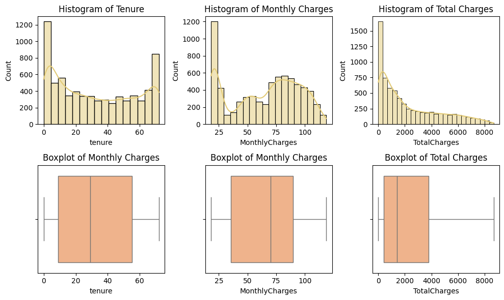
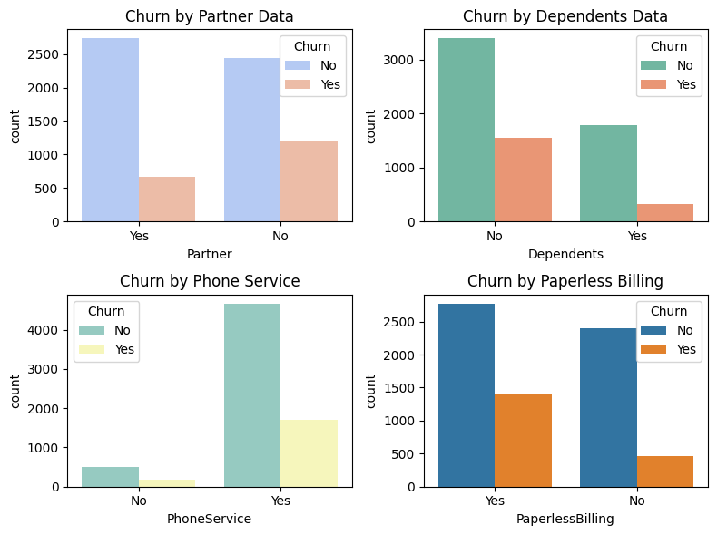
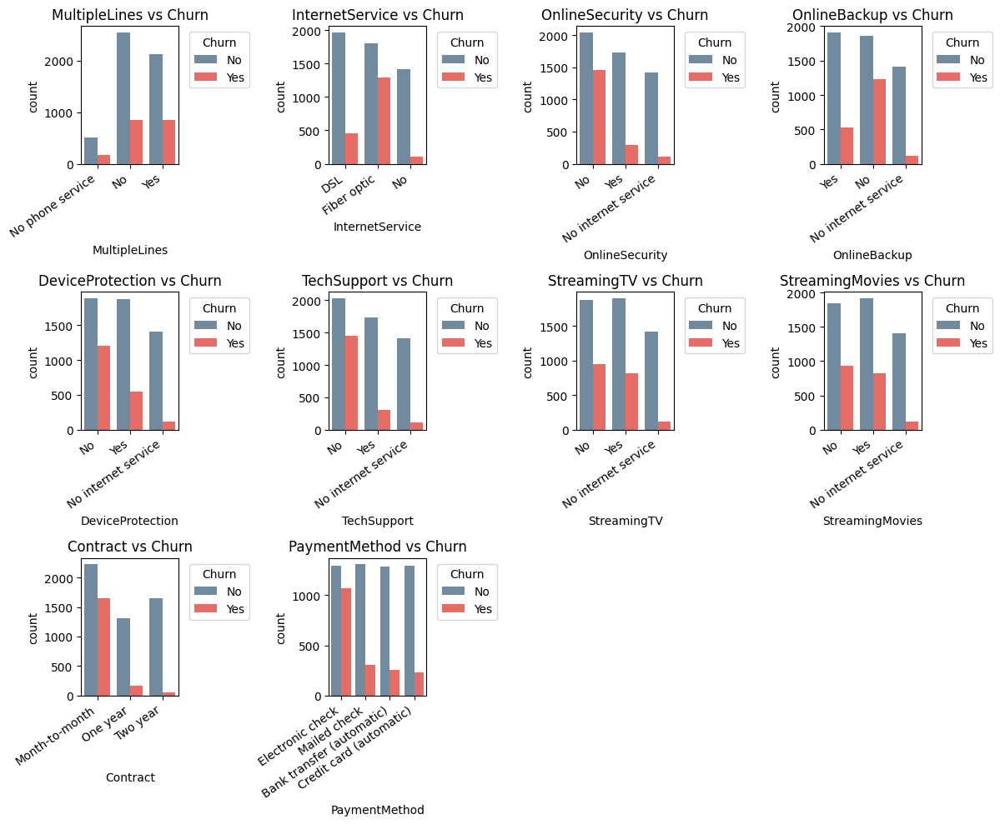

## 📌 Project Overview
Customer churn (when customers stop doing business with a company) is a critical problem for subscription-based and service industries.
In this project, I performed an End-to-End Exploratory Data Analysis (EDA) on a telecom churn dataset to identify key factors that drive customer churn and uncover insights that businesses can use to improve retention strategies.

This project is designed to demonstrate my data analysis, visualization, and storytelling skills for recruiters and data professionals.

## 🎯 Objectives
- Understand customer demographics and service usage patterns.
- Identify factors contributing to customer churn.
- Visualize trends and correlations with churn.
- Provide business recommendations for churn reduction.

## 🛠️ Tools & Libraries Used
- Python 🐍
- Pandas – Data manipulation
- NumPy – Numerical computations
- Matplotlib / Seaborn / Plotly – Data visualization
- Jupyter Notebook – Analysis environment

## 📂 Dataset
- Source: [Telco Customer Churn Dataset (Kaggle)](https://www.kaggle.com/datasets/blastchar/telco-customer-churn)
- Rows: 7,043
- Columns: 21
- Target Variable: Churn (Yes/No – whether a customer left the company)

## 📁 Project Structure
```
Customer-Churn-EDA/
│-- data/                # Dataset(s)
│-- notebooks/           # Jupyter notebook with full analysis
│-- images/              # Key visualizations (for README & LinkedIn posts)
│-- README.md            # Project documentation
```

##📊 Key Analysis & Insights
1️⃣ Customer Demographics
- Senior citizens have a higher churn rate.
- Customers without dependents are more likely to churn.

2️⃣ Service Usage
- Customers with month-to-month contracts churn significantly more than yearly/2-year contracts.
- Internet service type (Fiber optic vs DSL) plays a big role in churn.

3️⃣ Billing & Tenure
- Customers with electronic check payments show the highest churn.
- Longer-tenured customers have lower churn probability.

## 📈 Visual Highlights

Some visual insights from the analysis:


*Analysis of Tenure, Monthly Charges & Total Charges*


*Churn Distribution*


*Services vs Distribution*

## 🚀 Next Steps (Possible Extensions)
- Feature engineering + ML models (Logistic Regression, Random Forest) for churn prediction.
- Dashboard creation (Power BI / Tableau / Plotly Dash).
- Deployment of ML model via Flask/Streamlit.

## 👨‍💻 About Me

I’m Rohit, an aspiring Data Analyst → Data Scientist, passionate about solving business problems using data.

- 🔗 [LinkedIn Profile](www.linkedin.com/in/rohit-dhiman-258471140)
- 📂 [Check more of my projects on GitHub](https://github.com/Rohitd1907)

## ✨ If you found this project insightful, feel free to ⭐ the repo and connect with me on LinkedIn!
